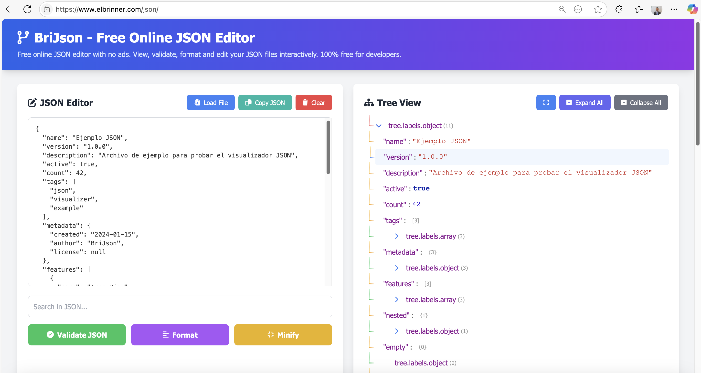
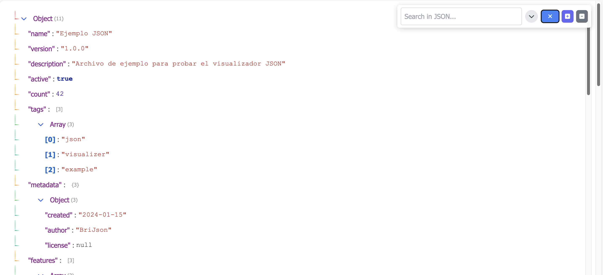
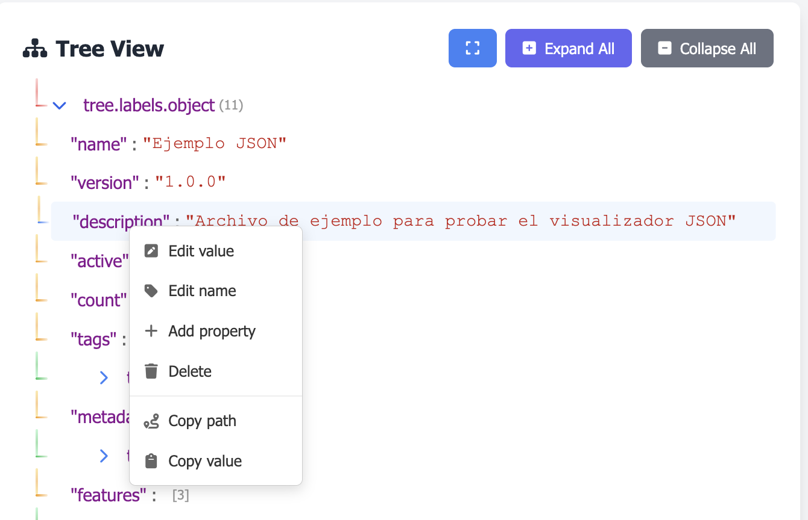

# 🌟 BriJson - JSON Viewer and Editor

[](https://www.elbrinner.com/json)
[](LICENSE)
[](https://www.elbrinner.com/json)

A modern, ad-free web tool for interactively viewing, editing, and validating JSON files.

🔗 **[Access now: www.elbrinner.com/json](https://www.elbrinner.com/json)**

---

## 🎯 Why BriJson?

In the development world, JSON viewers are essential tools. However, many available options are saturated with **invasive ads** that interrupt workflows and compromise privacy.

**BriJson emerges as a response to this problem**: an **100% ad-free** alternative, fast, and focused on developer productivity.

### Problems it solves:
- ✅ **No ads**: Work without distractions or invasive advertising
- ✅ **No tracking**: Your privacy matters, we don't track or store your data
- ✅ **Fast and lightweight**: No ad scripts that slow down your browser
- ✅ **Fully functional**: All features are free and accessible

---

## ✨ Main Features

### 📝 Advanced JSON Editor
- **Real-time editing** with automatic syntax validation
- **Autocompletion** and error detection
- **Automatic formatting** with configurable indentation
- **Minification** to optimize JSON size
- **Smart search** within JSON

### 🌲 Tree Visualization
- **Hierarchical view** with unlimited depth
- **Individual or all node expansion/collapse**
- **Visual icons** distinguishing objects, arrays, and primitives
- **Syntax colors**:
  - 🟣 Keys/properties in purple
  - 🔵 Array indices in blue
  - 🔴 Strings in red
  - 🔵 Numbers in blue
  - ⚫ Booleans and null values in gray
- **Full-screen mode** for viewing complex JSONs

### ✏️ Interactive Editing
- **Context menu** (right-click) with 6 actions:
  - ✏️ Edit value
  - 🏷️ Rename property
  - ➕ Add new property
  - 🗑️ Delete node
  - 📋 Copy full path
  - 📄 Copy value
- **Smart modals**:
  - Simplified modal for primitive values (string, number, boolean)
  - Advanced modal for complex objects and arrays
  - Dedicated modal for renaming properties
- **Real-time validation** when editing values

### 📊 Real-time Statistics
- **File size** (in bytes, KB, MB)
- **Number of lines**
- **Number of keys**
- **Number of objects and arrays**
- **Maximum tree depth**
- Visual presentation with colors and modern design

### 🚀 Additional Features
- **Load JSON files** from your device
- **Copy JSON** to clipboard with automatic formatting (one click)
- **Global search** in keys and values
- **Keyboard shortcuts**:
  - `Ctrl/Cmd + O`: Open file
  - `Ctrl/Cmd + S`: Format JSON
  - `Ctrl/Cmd + F`: Focus search
  - `Enter` (in search field): Go to next match
  - `F3`: Go to next match
  - `Ctrl/Cmd + G`: Go to next match
  - `ESC`: Close modals

### 🌐 Internationalization (i18n)
- Automatic language detection with persistence.
- Language selector in the footer.
- URL parameter for forcing language: `?lang=es|en|fr|de|pt|ru|hi|zh|ar|bn|ur`.
- Fallback to English if a string is missing.
- RTL (right-to-left) support for languages like Arabic and Urdu.

Included languages: Spanish (es), English (en), French (fr), German (de), Portuguese (pt), Russian (ru), Hindi (hi), Chinese (zh), Arabic (ar), Bengali (bn), Urdu (ur).

How to contribute a translation:
1) Duplicate `locales/en.json` as `locales/<code>.json`.
2) Translate the values while keeping the keys.
3) Verify it's valid JSON.
4) Test with `?lang=<code>` or change from the footer selector.

### 🔎 Advanced Search
- Search in keys and values, traversing nested structures.
- Automatically expand collapsed branches to reveal matches.
- Highlight results and allow navigation with the "Next" button.
- Cyclic navigation (back to start after the end).
- Shortcuts: `Enter` (in search), `F3`, `Ctrl/Cmd + G`.

### 🧴 Discrete Notifications (toasts)
- Displayed in the bottom-right corner and stacked orderly.
- Time-to-live and opacity adjusted by type (success, info, error).
- Strings compatible with i18n.

---

## 🖥️ Screenshots

### Editor and Viewer


### Edit Modal


### Context Menu


---

## 🏗️ Technical Architecture

### Technology Stack
- **Frontend**: HTML5, CSS3, JavaScript (ES6+)
- **UI Framework**: Tailwind CSS 3.4.0
- **Icons**: Font Awesome 6.4.0
- **Architecture**: Modular with 6 JavaScript modules
- **Workers**: Web Workers for background processing

### Project Structure
```
BriJson/
├── index.html              # Main interface
├── css/
│   └── styles.css         # Custom styles (660+ lines)
├── js/
│   ├── i18n.js            # Internationalization engine (auto-detect, selector, dynamic SEO)
│   ├── core.js            # Main coordinator (1070 lines)
│   ├── json-parser.js     # JSON parser and validator
│   ├── tree-renderer.js   # Tree renderer (540+ lines)
│   ├── modal-manager.js   # Modal system (540+ lines)
│   ├── utils.js           # Shared utilities
│   └── json-worker.js     # Web Worker for large JSONs
├── data/
│   └── sample.json        # Sample JSON
├── locales/               # Translation files (en, es, fr, de, pt, ru, hi, zh, ar, bn, ur)
│   └── *.json
├── docs/
│   └── images/            # Images used in README
└── README.md              # This file
```

### JavaScript Modules

#### 0. **i18n.js** - Internationalization
- Auto-detection of language + override by URL (`?lang=xx`) + persistence.
- Language selector in footer.
- Dynamic update of meta/SEO.

#### 1. **core.js** - Main Coordinator
- Application initialization
- DOM event management
- Coordination between modules
- Global state management

#### 2. **json-parser.js** - Parser and Validator
- Asynchronous parsing with Web Workers
- Syntax validation
- File statistics (size, keys, depth)
- JSON search

#### 3. **tree-renderer.js** - Tree Renderer
- Hierarchical tree construction
- Node expansion/collapse
- Colored visualization
- Unlimited depth handling

#### 4. **modal-manager.js** - Modal System
- Simplified modal for primitive values
- Advanced modal for objects/arrays
- Property renaming modal
- Validation and type conversion

#### 5. **utils.js** - Utilities
- Debounce and throttle
- Byte formatting
- Clipboard copying
- HTML escaping

#### 6. **json-worker.js** - Web Worker
- Background processing
- Parsing of large JSONs (100k+ lines)
- Statistics calculation
- Parallel search

---

## 🚀 Usage

### Online (Recommended)
Access directly from your browser:
👉 **[www.elbrinner.com/json](https://www.elbrinner.com/json)**

### Local
1. **Clone the repository**:
   ```bash
   git clone https://github.com/elbrinner/BriJson.git
   cd BriJson
   ```

2. **Start a local server**:
   ```bash
  # With Python 3 (macOS / Linux)
  python3 -m http.server 8000
   
   # With Node.js (http-server)
   npx http-server -p 8000
   
   # With PHP
   php -S localhost:8000
   ```

  Optional (VS Code): use the "Live Server" extension and open `index.html`.

  Tips:
  - If the port is busy, change `8000` to `8080` or `12345`.
  - To force a language during testing: `http://localhost:8000/?lang=fr`.

3. **Open in your browser**:
   ```
   http://localhost:8000
   ```

---

## 📖 Usage Examples

### 1. Load and Visualize a JSON
```json
{
  "user": {
    "id": 12345,
    "name": "María García",
    "email": "maria@example.com",
    "active": true
  },
  "roles": ["admin", "editor"]
}
```
1. Paste the JSON in the editor
2. Click "Validate JSON"
3. Explore the tree by expanding nodes

### 2. Edit a Value
1. **Right-click** on any property
2. Select **"Edit value"**
3. Modify the value in the modal
4. Save the changes

### 3. Rename a Property
1. **Right-click** on a property
2. Select **"Rename"**
3. Enter the new name
4. Confirm the change

### 4. Add a New Property
1. **Right-click** on an object
2. Select **"Add property"**
3. Define name and value
4. Save

### 5. Search and navigate matches
1. Type in the search field to find matches in keys/values.
2. Use the "Next" button or keys `Enter` (in search), `F3`, or `Ctrl/Cmd + G`.
3. The tree will expand automatically to show the result.

---

## 🔧 Advanced Configuration

### Customize Syntax Colors
Edit `css/styles.css`:
```css
.json-string { color: #c41a16; }  /* Strings in red */
.json-number { color: #1c00cf; }  /* Numbers in blue */
.json-key { color: #881391; }     /* Keys in purple */
```

### Adjust Expansion Depth
In `js/core.js`, modify:
```javascript
this.treeRenderer.expandToDepth(3); // Expand 3 levels by default
```

### Change language by URL or selector
- Footer selector (persistent across sessions).
- Force by URL: `?lang=es|en|fr|de|pt|ru|hi|zh|ar|bn|ur` — example: `?lang=fr`.
- Automatic fallback to English if a key doesn't exist in the selected language.

---

## 🤝 Contributing

Contributions are welcome! If you want to improve BriJson:

1. **Fork** the repository
2. Create a **branch** for your feature (`git checkout -b feature/new-functionality`)
3. **Commit** your changes (`git commit -m 'Add new functionality'`)
4. **Push** to the branch (`git push origin feature/new-functionality`)
5. Open a **Pull Request**

### Areas for Improvement
- [x] Advanced search with automatic path expansion
- [x] Full-screen mode with compact toolbar
- [x] Complete internationalization (11 languages) with auto-detection and persistence
- [x] Discrete notifications (toasts) with stacking and TTL by type
- [x] Large JSON processing with background Web Workers
- [x] Real-time statistics (size, lines, keys, depth)
- [x] Copy full path and value to clipboard
- [x] Automatic JSON formatting and minification
- [x] Real-time JSON syntax validation
- [x] Load JSON files from local system
- [ ] Inline editing (double-click on values)
- [ ] Change history (Ctrl+Z / undo)
- [ ] Export modified JSON as file
- [ ] Visual diff between JSON versions
- [ ] Dark/light theme with persistence
- [ ] Support for JSON Schema validation
- [ ] Import/export custom configurations
- [ ] Customizable keyboard shortcuts
- [ ] Side-by-side comparison mode
- [ ] REST API integration for remote loading
- [ ] Automatic JSON Schema generation from data
- [ ] Batch mode for processing multiple files

---

## 🐛 Report Bugs

If you find a bug:
1. Check if it's not already reported in [Issues](https://github.com/elbrinner/BriJson/issues)
2. Create a new issue with:
   - Problem description
   - Steps to reproduce
   - Browser and version
   - Sample JSON (if applicable)

---

## 📜 License

This project is under the MIT License. See the [LICENSE](LICENSE) file for more details.

---

## �️ Recent Changelog

### 2025-10-24
- Complete internationalization (i18n): auto-detection, footer selector, `?lang=xx`, fallback to English, RTL support.
- Integrated documentation (SEO Content) about editing/adding nodes and searching in JSON (multilingual).
- Advanced search: automatic path expansion, result highlighting, "Next" button and shortcuts (Enter/F3/Cmd+G).
- Improved full-screen mode with compact toolbar.
- Refined notifications (toasts): location, stacking and TTL/opacity by type.
- Updated translations: es, en, fr, de, pt, ru, hi, zh, ar, bn, ur.

---

## �🙏 Acknowledgments

- **Icons**: Font Awesome
- **CSS Framework**: Tailwind CSS
- **Community**: All developers suffering with complex JSONs

---

## 📞 Contact

- **Web**: [www.elbrinner.com](https://www.elbrinner.com)
- **Tool**: [www.elbrinner.com/json](https://www.elbrinner.com/json)
- **Email**: elbrinner@elbrinner.com

---

## 🌟 Do you like BriJson?

If you find this tool useful:
- ⭐ Star it on GitHub
- 🔗 Share it with other developers
- 💬 Leave your comments and suggestions
- 🐛 Report bugs to help us improve
- 💻 **Contribute improvements** - This project accepts Pull Requests
- 🚀 **Propose new features** - Your ideas are welcome

### 💡 Have an idea?
BriJson is an open-source project that **accepts Pull Requests**. If you have an improvement, correction, or new functionality in mind:
1. Check the [suggested improvement areas](#🤝-contributing)
2. Propose your idea in an Issue
3. Develop your improvement
4. Send a Pull Request

Your contribution can help thousands of developers! 💪

---

**BriJson** - Developed with ❤️ for the developer community

*Ad-free. No tracking. Just clean code.*

[](https://www.elbrinner.com/json)

---

---

## 🖥️ Capturas de Pantalla

### Editor y Visualizador


### Edición con Modal Simplificado


### Menú Contextual


---

## 🏗️ Arquitectura Técnica

### Stack Tecnológico
- **Frontend**: HTML5, CSS3, JavaScript (ES6+)
- **UI Framework**: Tailwind CSS 3.4.0
- **Iconos**: Font Awesome 6.4.0
- **Arquitectura**: Modular con 6 módulos JavaScript
- **Workers**: Web Workers para procesamiento en segundo plano

### Estructura del Proyecto
```
BriJson/
├── index.html              # Interfaz principal
├── css/
│   └── styles.css         # Estilos personalizados (660+ líneas)
├── js/
│   ├── i18n.js            # Motor de internacionalización (auto-detect, selector, SEO dinámico)
│   ├── core.js            # Coordinador principal (1070 líneas)
│   ├── json-parser.js     # Parser y validador JSON
│   ├── tree-renderer.js   # Renderizador del árbol (540+ líneas)
│   ├── modal-manager.js   # Sistema de modales (540+ líneas)
│   ├── utils.js           # Utilidades compartidas
│   └── json-worker.js     # Web Worker para JSON pesados
├── data/
│   └── sample.json        # JSON de ejemplo
├── locales/               # Archivos de traducción (en, es, fr, de, pt, ru, hi, zh, ar, bn, ur)
│   └── *.json
├── docs/
│   └── images/            # Capturas usadas en el README
└── README.md              # Este archivo
```

### Módulos JavaScript

#### 0. **i18n.js** - Internacionalización
- Auto-detección de idioma + override por URL (`?lang=xx`) + persistencia.
- Selector de idioma en el footer.
- Fallback a inglés y actualización dinámica de meta/SEO.

#### 1. **core.js** - Coordinador Principal
- Inicialización de la aplicación
- Gestión de eventos del DOM
- Coordinación entre módulos
- Manejo de estado global

#### 2. **json-parser.js** - Parser y Validador
- Parsing asíncrono con Web Workers
- Validación de sintaxis JSON
- Estadísticas del archivo (tamaño, claves, profundidad)
- Búsqueda en JSON

#### 3. **tree-renderer.js** - Renderizador del Árbol
- Construcción del árbol jerárquico
- Expansión/colapso de nodos
- Visualización con colores sintácticos
- Manejo de profundidad ilimitada

#### 4. **modal-manager.js** - Sistema de Modales
- Modal simplificado para valores primitivos
- Modal avanzado para objetos/arrays
- Modal de renombrado de propiedades
- Validación y conversión de tipos

#### 5. **utils.js** - Utilidades
- Debounce y throttle
- Formateo de bytes
- Copia al portapapeles
- Escape de HTML

#### 6. **json-worker.js** - Web Worker
- Procesamiento en segundo plano
- Parsing de JSONs grandes (100k+ líneas)
- Cálculo de estadísticas
- Búsqueda paralela

---

## 🚀 Uso

### Online (Recomendado)
Accede directamente desde tu navegador:
👉 **[www.elbrinner.com/json](https://www.elbrinner.com/json)**

### Local
1. **Clona el repositorio**:
   ```bash
   git clone https://github.com/tuusuario/BriJson.git
   cd BriJson
   ```

2. **Inicia un servidor local**:
   ```bash
  # Con Python 3 (macOS / Linux)
  python3 -m http.server 8000
   
   # Con Node.js (http-server)
   npx http-server -p 8000
   
   # Con PHP
   php -S localhost:8000
   ```

  Opcional (VS Code): usa la extensión “Live Server” y abre `index.html`.

  Consejos:
  - Si el puerto está ocupado, cambia `8000` por `8080` o `12345`.
  - Para forzar un idioma durante pruebas: `http://localhost:8000/?lang=fr`.

3. **Abre en tu navegador**:
   ```
   http://localhost:8000
   ```

---

## 📖 Ejemplos de Uso

### 1. Cargar y Visualizar un JSON
```json
{
  "usuario": {
    "id": 12345,
    "nombre": "María García",
    "email": "maria@example.com",
    "activo": true
  },
  "roles": ["admin", "editor"]
}
```
1. Pega el JSON en el editor
2. Haz clic en "Validar JSON"
3. Explora el árbol expandiendo nodos

### 2. Editar un Valor
1. Haz **clic derecho** en cualquier propiedad
2. Selecciona **"Editar valor"**
3. Modifica el valor en el modal
4. Guarda los cambios

### 3. Renombrar una Propiedad
1. Haz **clic derecho** en una propiedad
2. Selecciona **"Editar nombre"**
3. Escribe el nuevo nombre
4. Confirma el cambio

### 4. Agregar una Nueva Propiedad
1. Haz **clic derecho** en un objeto
2. Selecciona **"Agregar propiedad"**
3. Define nombre y valor
4. Guarda

### 5. Buscar y navegar coincidencias
1. Escribe en el buscador para encontrar coincidencias en claves/valores.
2. Usa el botón “Siguiente” o las teclas `Enter` (en el buscador), `F3` o `Ctrl/Cmd + G`.
3. El árbol se expandirá automáticamente para mostrar el resultado.

---

## 🔧 Configuración Avanzada

### Personalizar Colores Sintácticos
Edita `css/styles.css`:
```css
.json-string { color: #c41a16; }  /* Strings en rojo */
.json-number { color: #1c00cf; }  /* Números en azul */
.json-key { color: #881391; }     /* Claves en morado */
```

### Ajustar Profundidad de Expansión
En `js/core.js`, modifica:
```javascript
this.treeRenderer.expandToDepth(3); // Expande 3 niveles por defecto
```

### Cambiar idioma por URL o selector
- Selector en el footer (persistente entre sesiones).
- Forzar por URL: `?lang=es|en|fr|de|pt|ru|hi|zh|ar|bn|ur` — ejemplo: `?lang=fr`.
- Fallback automático a inglés si una clave no existe en el idioma seleccionado.

---

## 🤝 Contribuir

¡Las contribuciones son bienvenidas! Si deseas mejorar BriJson:

1. **Fork** el repositorio
2. Crea una **rama** para tu feature (`git checkout -b feature/nueva-funcionalidad`)
3. **Commit** tus cambios (`git commit -m 'Añade nueva funcionalidad'`)
4. **Push** a la rama (`git push origin feature/nueva-funcionalidad`)
5. Abre un **Pull Request**

### Áreas de Mejora
- [x] Búsqueda avanzada con expansión automática de rutas y navegación cíclica
- [x] Modo pantalla completa con toolbar compacta
- [x] Internacionalización completa (11 idiomas) con detección automática y persistencia
- [x] Notificaciones discretas (toasts) con apilado y TTL por tipo
- [x] Procesamiento de JSONs grandes con Web Workers en segundo plano
- [x] Estadísticas en tiempo real (tamaño, líneas, claves, profundidad)
- [x] Copiar path completo y valor al portapapeles
- [x] Formateo automático y minificación de JSON
- [x] Validación de sintaxis JSON en tiempo real
- [x] Carga de archivos JSON desde el sistema local
- [ ] Edición inline (doble clic en valores)
- [ ] Historial de cambios (Ctrl+Z / deshacer)
- [ ] Exportar JSON modificado como archivo
- [ ] Diff visual entre versiones de JSON
- [ ] Tema oscuro/claro con persistencia
- [ ] Soporte para validación con JSON Schema
- [ ] Importar/exportar configuraciones personalizadas
- [ ] Atajos de teclado personalizables
- [ ] Modo comparación lado a lado
- [ ] Integración con APIs REST para carga remota
- [ ] Generación automática de JSON Schema desde datos
- [ ] Modo batch para procesar múltiples archivos

---

## 🐛 Reportar Errores

Si encuentras un error:
1. Verifica que no esté ya reportado en [Issues](https://github.com/tuusuario/BriJson/issues)
2. Crea un nuevo issue con:
   - Descripción del problema
   - Pasos para reproducirlo
   - Navegador y versión
   - JSON de ejemplo (si aplica)

---

## 📜 Licencia

Este proyecto está bajo la Licencia MIT. Consulta el archivo [LICENSE](LICENSE) para más detalles.

---

## �️ Changelog reciente

### 2025-10-24
- Internacionalización completa (i18n): auto-detección, selector en footer, `?lang=xx`, fallback a inglés, soporte RTL.
- Nueva documentación integrada (SEO Content) sobre cómo editar/agregar nodos y cómo buscar en JSON (multilenguaje).
- Búsqueda avanzada: expansión automática de rutas, resaltado de coincidencias, botón “Siguiente” y atajos (Enter/F3/Cmd+G).
- Modo pantalla completa mejorado con toolbar compacta.
- Notificaciones (toasts) refinadas: ubicación, apilado y TTL/opacity por tipo.
- Traducciones actualizadas: es, en, fr, de, pt, ru, hi, zh, ar, bn, ur.

---

## �🙏 Agradecimientos

- **Iconos**: Font Awesome
- **Framework CSS**: Tailwind CSS
- **Comunidad**: Todos los desarrolladores que sufren con JSONs complejos

---

## 📞 Contacto

- **Web**: [www.elbrinner.com](https://www.elbrinner.com)
- **Herramienta**: [www.elbrinner.com/json](https://www.elbrinner.com/json)
- **Email**: elbrinner@elbrinner.com

---

## 🌟 ¿Te gusta BriJson?

Si encuentras útil esta herramienta:
- ⭐ Dale una estrella en GitHub
- 🔗 Compártela con otros desarrolladores
- 💬 Deja tus comentarios y sugerencias
- 🐛 Reporta bugs para ayudarnos a mejorar
- 🔧 **Contribuye con mejoras** - Este proyecto está abierto a sugerencias y Pull Requests
- 🚀 **Propón nuevas funcionalidades** - Tus ideas son bienvenidas

### 💡 ¿Tienes una idea?
BriJson es un proyecto de código abierto que **acepta Pull Requests**. Si tienes una mejora, corrección o nueva funcionalidad en mente:
1. Revisa las [áreas de mejora sugeridas](#🤝-contribuir)
2. Propón tu idea en un Issue
3. Desarrolla tu mejora
4. Envía un Pull Request

¡Tu contribución puede ayudar a miles de desarrolladores! 💪

---

**BriJson** - Desarrollado con ❤️ para la comunidad de desarrolladores

*Sin publicidad. Sin seguimiento. Solo código limpio.*

[](https://www.elbrinner.com/json)
